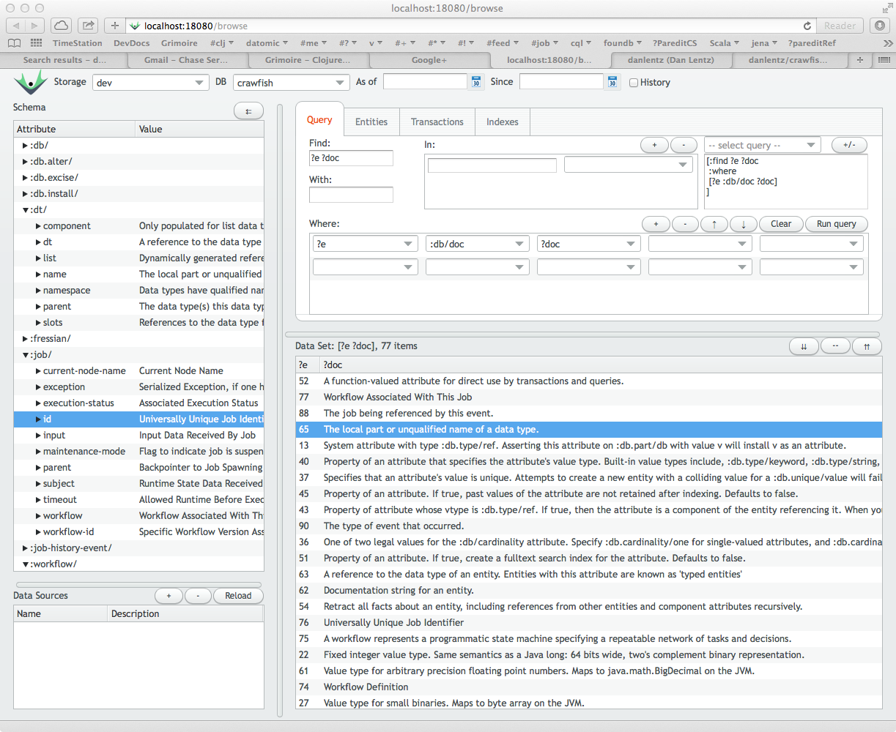

== toolchain

=== Clojure REPL

As with many lisps, the REPL is at the heart of the Clojure
developer's experience.  The `datomodel.user` namespace has a number
of helpful defaults, such as shortcut prefixes for interactive use
of many of the datomodel library components. Activating the
`datomodel.user` namespace is shown below.

[source,clojure]
.activate `datomodel.user` namespace
----
user> (in-ns 'datomodel.user)
datomodel.user> ◼
----

=== Datomic Console

=== Ascii Doctor

The lein-asciidoctor plugin
<https://github.com/asciidoctor/asciidoctor-lein-plugin>  is used to
generate static html5 content from AsciiDoc lightweight text markup
format source files.  Enable the asciidoctor plugin within leiningen
by adding lein-asciidoctor to your ~/lein/profile.clj.

Asciidoctor may be configured within a project's project.clj file:

[source,clojure]
----
(defproject foo "10.10.10-SNAPSHOT"
  :dependencies [[org.clojure/clojure "1.6.0"]]
  :asciidoc    {:sources ["doc/*.adoc"]
                   :toc              :left
                   :format           :html5
                   :extract-css      true
                   :source-highlight true})
----
